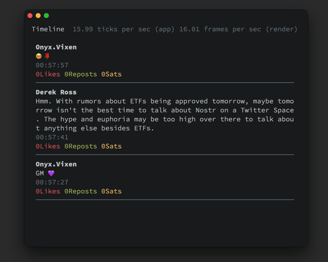

# nostui

[](https://crates.io/crates/nostui)
[](https://github.com/akiomik/nostui/actions)

A TUI client for [Nostr](https://nostr.com)



## Current Features

- Timeline
- Post, Reply, React, Repost

## Getting Started

Dowonload binaries from the [release](https://github.com/akiomik/nostui/releases/latest) page.

Or, install manually via `crates.io`:

```shell
cargo install nostui
```

On NetBSD, a package is available from the official repositories. To install it, simply run:

```shell
pkgin install nostui
```

## Setup

> [!NOTE]
> Other extensions supported are `.json5`, `.yaml`, `.toml` and `.ini`.

1. Create a `config.json` to the following path:

- Linux: `~/.config/nostui/config.json`
- Windows: `~\AppData\Roaming\0m1\nostui\config.json`
- macOS: `~/Library/Application Support/io.0m1.nostui/config.json`

2. Add your privatekey to the `config.json`:

```json5
{
    "privatekey": "nsec1...",
    "relays": ["wss://nos.lol"] // optional
}
```

## Usage

### Commands

```shell
nostui [OPTIONS]

Options:
  -t, --tick-rate <FLOAT>   Tick rate, i.e. number of ticks per second [default: 16]
  -f, --frame-rate <FLOAT>  Frame rate, i.e. number of frames per second [default: 16]
  -h, --help                Print help
  -V, --version             Print version
```

### Default Keybindings

| Keybinding            | Description                |
| --------------------- | -------------------------- |
| `k` `up`              | Scroll up                  |
| `j` `down`            | Scroll down                |
| `q` `Ctrl-c` `Ctrl-d` | Quit                       |
| `home` `g`            | Scroll to top              |
| `end` `Shift-g`       | Scroll to bottom           |
| `Ctrl-z`              | Suspend                    |
| `esc`                 | Unselect                   |
| `n`                   | New text note              |
| `Ctrl-p`              | Submit text note           |
| `r`                   | Reply to the selected note |
| `f`                   | Send reaction              |
| `t`                   | Repost                     |
