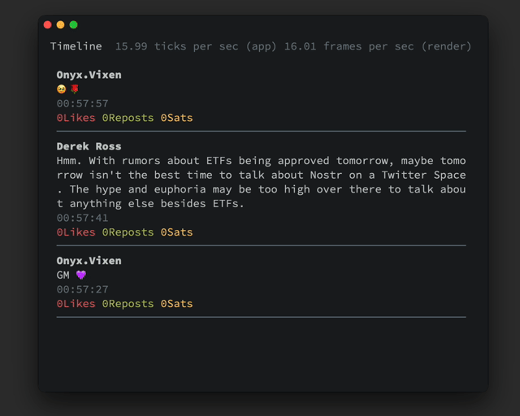

# nostui

[](https://crates.io/crates/nostui)
[](https://github.com/akiomik/nostui/actions)
[](https://codecov.io/gh/akiomik/nostui)

A TUI client for [Nostr](https://nostr.com)



## Current Features

- Timeline
- Mention timeline
- Post, reply, react and repost
- Open per-user timelines as tabs
- Broadcast the currently playing track as a music status (NIP-38)

## Getting Started

Dowonload binaries from the [release](https://github.com/akiomik/nostui/releases/latest) page.

Or, install manually via `crates.io`:

```shell
cargo install nostui
```

On NetBSD, a package is available from the official repositories. To install it, simply run:

```shell
pkgin install nostui
```

## Setup

> [!NOTE]
> Other extensions supported are `.json5`, `.yaml`, `.toml` and `.ini`.

1. Create a `config.json` to the following path:

- Linux: `~/.config/nostui/config.json`
- Windows: `~\AppData\Roaming\0m1\nostui\config.json`
- macOS: `~/Library/Application Support/io.0m1.nostui/config.json`

2. Add your key to the `config.json`:

```json5
{
    "key": "nsec1...", // or "npub..." for readonly mode
    "relays": ["wss://nos.lol"], // optional
    "nip-38": { "enabled": true } // optional, broadcasts the currently playing track as a status (default: false)
}
```

## Usage

### Commands

```shell
nostui [OPTIONS]

Options:
  -t, --tick-rate <FLOAT>   Tick rate, i.e. number of ticks per second [default: 16]
  -f, --frame-rate <FLOAT>  Frame rate, i.e. number of frames per second [default: 16]
  -h, --help                Print help
  -V, --version             Print version
```

### Default Keybindings

| Keybinding            | Description                         |
| --------------------- | ----------------------------------- |
| `k` `up`              | Scroll up                           |
| `j` `down`            | Scroll down (load more at bottom)   |
| `home` `g`            | Scroll to top                       |
| `end` `Shift-g`       | Scroll to bottom                    |
| `esc`                 | Unselect                            |
| `n`                   | New text note                       |
| `Ctrl-p`              | Submit text note                    |
| `r`                   | Reply to the selected note          |
| `f`                   | Send reaction                       |
| `t`                   | Repost                              |
| `i`                   | Open the author's timeline as a tab |
| `m`                   | Open the mention timeline as a tab  |
| `h` `left`            | Switch to the previous tab          |
| `l` `right`           | Switch to the next tab              |
| `Ctrl-w`              | Close the current tab               |
| `q` `Ctrl-c` `Ctrl-d` | Quit                                |

### Customizing Keybindings

You can override or add keybindings in your config file under `keybindings.Home`. Your settings are merged on top of the defaults, so you only need to list the keys you want to change.

```json5
{
    "keybindings": {
        "Home": {
            "<Ctrl-r>": "Repost",  // bind an additional key to an action
            "<t>": "ScrollToTop"   // override an existing default
        }
    }
}
```

Each key is written between `<` and `>`. Modifiers are joined with `-` (e.g. `<Ctrl-p>`, `<Shift-g>`, `<Alt-Enter>`). Special keys such as `up`, `down`, `home`, `end`, `esc`, `enter`, `tab` and `space` are also supported.

> [!NOTE]
> Because your settings are merged on top of the defaults, default keybindings cannot be removed. You can only add new keys or rebind a key to a different action.

The following actions are available:

| Action             | Description                          |
| ------------------ | ------------------------------------ |
| `ScrollUp`         | Scroll up                            |
| `ScrollDown`       | Scroll down (load more at bottom)    |
| `ScrollToTop`      | Scroll to top                        |
| `ScrollToBottom`   | Scroll to bottom                     |
| `Unselect`         | Unselect the selected note           |
| `NewTextNote`      | Show the text note input form        |
| `ReplyTextNote`    | Reply to the selected note           |
| `SubmitTextNote`   | Submit the text note on input form   |
| `React`            | Send a reaction to the selected note |
| `Repost`           | Repost the selected note             |
| `OpenAuthorTimeline` | Open the author's timeline as a tab |
| `OpenMentionTab`   | Open the mention timeline as a tab   |
| `CloseCurrentTab`  | Close the current tab                |
| `PrevTab`          | Switch to the previous tab           |
| `NextTab`          | Switch to the next tab               |
| `Quit`             | Quit the application                 |

## Architecture

For how the codebase is organised — the layers, their dependency direction, and
the contracts between them — see [docs/architecture.md](docs/architecture.md).
