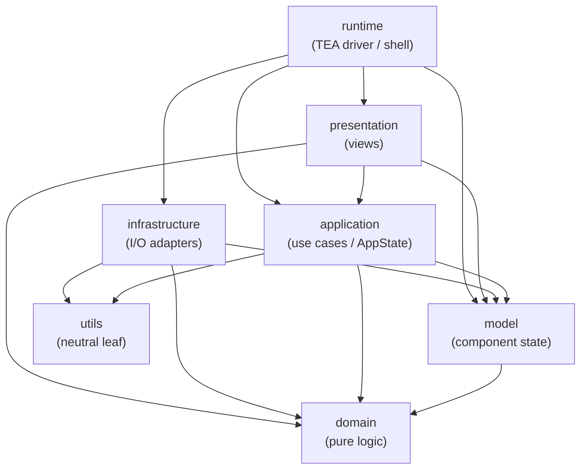
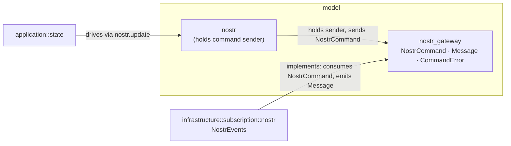
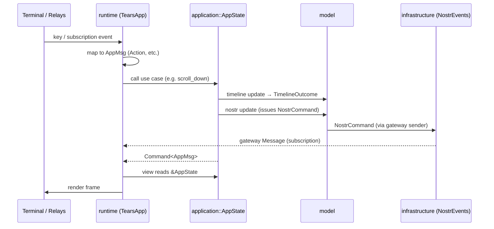

# Architecture

This document describes how `nostui` is structured: the layers, the direction
in which they may depend on each other, and the contracts that connect them.

`nostui` is a TUI built on [The Elm Architecture](https://guide.elm-lang.org/architecture/)
(via the [`tears`](https://crates.io/crates/tears) framework) over the
[`nostr-sdk`](https://crates.io/crates/nostr-sdk). The codebase is organised
into layers under `src/`, each a top-level module declared in `lib.rs`.

## Layers at a glance

| Layer (`src/…`) | Role | May depend on |
| --- | --- | --- |
| `domain` | Pure Nostr/business logic. No I/O, no UI, no framework. | (nothing internal) |
| `model` | Component state (the TEA "Model" pieces) and the gateway contract. | `domain` |
| `application` | Use-case layer: the aggregate `AppState`, the message vocabulary, and configuration. | `domain`, `model`, `utils` |
| `infrastructure` | Outward adapters: CLI, signer, and the Nostr subscription/I/O worker. | `domain`, `model`, `utils` |
| `presentation` | Views: widgets and components that render `AppState`. | `domain`, `model`, `application` |
| `runtime` | The TEA driver / imperative shell (`TearsApp`): bootstrap, update dispatch, subscriptions, input→message. | everything below |
| `utils` | Neutral leaf helpers (logging, panic, paths). | (nothing internal) |

`main.rs` is the binary entry point: it parses the CLI, loads `Config`, builds
the Nostr client, and hands an `InitFlags` to the `runtime`.

## The dependency rule

> Dependencies point **inward / downward**. An outer layer may depend on an
> inner layer; an inner layer must never depend on an outer one.

Ordering from innermost to outermost:

```
domain  <  model  <  application  <  { presentation, infrastructure }  <  runtime
```

The `<` is a layering convenience, not a claim that every outer layer calls the
one directly inside it. In particular `infrastructure` does **not** depend on
`application`: they are siblings that communicate through the `model`-owned
gateway contract (see [Contracts](#contracts)), not a linear caller/callee pair.

`utils` is a neutral leaf with no internal dependencies; any inner layer **may**
use it. The graph below draws only the edges that exist today
(`application` / `infrastructure` → `utils`); the permission is broader than the
current usage.



The graph is **acyclic**. In particular:

- `application` does **not** depend on `infrastructure` or `presentation`
  (the outer adapters). Where an inner layer would otherwise need an outer one,
  the dependency is inverted through a contract owned by the inner layer
  (see [Contracts](#contracts)).
- `presentation -> application` is intentional and correct: it is the TEA
  `view(model)` relationship — views read the Model, they never mutate it.

### Checking the rule

A quick audit of cross-layer references (grouped `use` imports included):

```sh
for layer in domain model application infrastructure presentation runtime utils; do
  echo "### from $layer"
  grep -rhoE '\b(domain|model|application|infrastructure|presentation|runtime|utils)::' \
    "src/$layer" "src/$layer.rs" 2>/dev/null \
    | sed -E 's/:://' | sort | uniq -c | grep -vE " $layer$"
done
```

Anything that makes an inner layer reference an outer one is a regression.

This grep is a best-effort heuristic, not a proof: it keys on path-qualified
references (`outer::`), so it misses a violation that `use`-imports a name and
then uses it unqualified, as well as re-exports and aliases. For a hard
guarantee, complement it with a dependency lint (e.g. `cargo-modules`).

## Layers in detail

### `domain` — pure logic

Nostr- and text-domain logic with no dependency on any framework, I/O, or UI
concept. Key modules/types:

- `domain::nostr` — `Profile`, `SortableEventId`, `FeedKind` (which feed a
  timeline displays: `Home` / `Author(pubkey)`), NIP helpers (`nip10`
  `ReplyTagsBuilder`, `nip27`, `nip38` `MusicStatus`), and `feed_filter`
  (pure functions that build subscription filters).
- `domain::collections` — `EventSet`.
- `domain::text` — `wrap_text`, `truncate_text`, `shorten_npub`.

**Invariant:** `domain` is free of UI concepts. `FeedKind` captures *which feed*
(a domain concept), but the layer knows nothing of "tabs" (a UI notion):
`domain::nostr::feed_filter` stays parametric and takes concrete inputs
(pubkeys, timestamps); the infrastructure adapter maps a `FeedKind` to the
appropriate filter. This keeps the filter rules pure and unit-testable.

### `model` — component state

The TEA "Model" broken into components, each with its own message type and an
`update` that — with one documented exception (`model::nostr`) — is side-effect
free. Key modules/types:

- `model::timeline` — `Timeline` and its `TimelineTab` (the UI surface that
  displays a `domain::nostr::FeedKind`), plus child components `selection`,
  `pagination`, `text_note`.
- `model::editor`, `model::status_bar`, `model::fps`.
- `model::nostr` — connection state; owns the command sender to the gateway and
  is the one component whose `update` sends `NostrCommand`s on it directly (see
  the invariant below).
- `model::nostr_gateway` — the **Nostr gateway contract** (see below).

**Invariant:** with one exception, `model::update` methods are side-effect free.
They mutate state and, when the application must act, **report an outcome**
rather than issuing an effect. `TimelineTab::update` / `Timeline::update` return
`TimelineOutcome` (`None` / `LoadMoreRequested`); the application decides what to
run. `editor`, `status_bar`, and `fps` are likewise pure.

**The exception is `model::nostr`.** It holds the gateway `sender`, and its
`update` issues commands on it directly — e.g. `EventSubmitted` →
`NostrCommand::SendEventBuilder`, `HistoryRequested` → `NostrCommand::LoadMore`,
`ConnectionClosed` → `NostrCommand::Shutdown`. These are fire-and-forget channel
sends, not TEA `Command<AppMsg>` effects: `application::state` drives them by
calling `self.nostr.update(…)`, but the send itself happens inside the model.
This is a deliberate seam — the component that *owns* the sender is the one that
sends — and the lone place a `model` `update` performs I/O.

### `application` — use cases

The application/use-case layer. It owns the aggregate state and the message
vocabulary, and orchestrates effects. Key modules/types:

- `application::state` — `AppState`, the aggregate Model. Its command methods
  (`scroll_down`, `react_to_selected`, `load_more_timeline`, …) are the
  use cases; they coordinate sub-models, talk to the gateway, and return
  `Command<AppMsg>`. Also `Startup` and `UserState`.
- `application::message` — `AppMsg` and its groups (`SystemMsg`, `TimelineMsg`,
  `EditorMsg`, `NostrMsg`). The message contract for the whole app.
- `application::config` — `Config` (loaded from files), plus the UI config value
  types `keybindings` (`KeyBindings`, `Action`) and `styles` (`Styles`).

### `infrastructure` — I/O adapters

Outward adapters to the OS and network. Key modules/types:

- `infrastructure::cli` — `Cli` argument parsing.
- `infrastructure::nostr` — `PublicKeySigner`.
- `infrastructure::subscription` — `NostrEvents` (the Nostr subscription/command
  worker) and `MediaEvents`. `NostrEvents` **implements** the gateway contract:
  it consumes `NostrCommand` and emits `model::nostr_gateway::Message`.

**Invariant:** infrastructure depends inward (on `model`/`domain`) only. It never
defines types that inner layers must import; instead it depends on the contracts
they own.

### `presentation` — views

Stateless rendering. Key modules/types:

- `presentation::components` — `Components`, `HomeComponent`, `HomeListComponent`
  (own the render entry points; read `AppState`).
- `presentation::widgets` — reusable widgets (`TextNoteWidget`, `TabBarWidget`,
  `StatusBarWidget`, `EditorWidget`, …).

**Invariant:** views are read-only over `AppState`. They produce no state
mutations and emit no effects.

### `runtime` — TEA driver

`runtime::TearsApp` implements `tears::Application`. It is the imperative shell /
composition driver and the only place that bridges the framework:

- `new` bootstraps `AppState` and components from `InitFlags`.
- `update` routes an `AppMsg` to the matching `AppState` use case.
- `subscriptions` wires `NostrEvents`, the timer, terminal events, media, and
  OS signals.
- `view` renders the components against `&AppState`.
- input handling maps key events to a configured `Action` and then to an `AppMsg`.

## Contracts

These are the seams that keep the dependency graph acyclic.

### Nostr gateway (Dependency Inversion)

The protocol between the app and the network worker lives in **`model`**, the
inner layer, so that `infrastructure` (the adapter) depends inward on it instead
of the app depending outward on infrastructure.

- `model::nostr_gateway::NostrCommand` — commands sent to the worker
  (subscribe, load more, send event, …).
- `model::nostr_gateway::Message` — messages emitted back (relay notifications,
  `Ready { sender }`, errors, subscription created).
- `model::nostr_gateway::CommandError` — command failures.



It lives in `model` for two reasons. **Why not `domain`:** it carries the
`tokio` command channel (`Message::Ready { sender }`) and relay-lifecycle
commands (`AddRelay`, `Shutdown`) — async-runtime and I/O concerns the domain
layer is kept free of. **Why not `application`:** `infrastructure` (the adapter)
depends only on `model`, `domain`, and `utils`, never on `application`; placing
the contract there would force the very `infrastructure -> application` edge the
dependency rule forbids. With `domain` ruled out (I/O concerns) and `utils` a
neutral leaf that may not reference `FeedKind`, `model` — already a dependency of
`infrastructure` and free to carry I/O concerns — is the only inner layer that
fits. Its feed identity comes from `domain::nostr::FeedKind`, a downward
dependency.

### Outcome reporting (model → application)

Apart from `model::nostr` (above), `model` components do not issue effects. When
a state transition requires an effect, the `update` returns a `TimelineOutcome`
and the application acts on it:

```rust
// application::state
pub fn scroll_down(&mut self) -> Command<AppMsg> {
    match self.timeline.update(TimelineMessage::NextItemSelected) {
        TimelineOutcome::LoadMoreRequested => self.load_more_timeline(),
        TimelineOutcome::None => Command::none(),
    }
}
```

### Messages

`application::message::AppMsg` is the single message vocabulary. The `runtime`
translates external input (keys → `Action` → `AppMsg`, subscription events →
`AppMsg`) and feeds it to `AppState`; sub-models keep their own private message
enums and are driven by `AppState`, not by `AppMsg` directly.

### Configuration

`application::config::Config` aggregates all settings — app/Nostr settings plus
the UI value types `KeyBindings` and `Styles` — and loads/merges them from
config files. `runtime` reads `config.keybindings` to resolve input; `main.rs`
builds the `Config` at startup.

## End-to-end flow



> [!NOTE]
> The `MD ->> IN` arrow (`NostrCommand`) is a **channel send**, not a direct
> call. `application` has no compile-time dependency on `infrastructure`: it
> drives `model::nostr` via `update`, and that component — which holds the
> gateway sender — performs the send. The sequence shows message flow, not
> import direction.

## Design principles

1. **Dependencies point inward.** Outer adapters depend on inner layers; never
   the reverse. Invert via inner-owned contracts when needed.
2. **`domain` is pure.** No framework, I/O, UI, or model concepts.
3. **`model` is side-effect free, save one seam.** Component `update`s mutate
   state and report outcomes for the application to act on. The exception is
   `model::nostr`, which owns the gateway sender and issues `NostrCommand`s on it
   directly.
4. **One message vocabulary.** `AppMsg` is defined in `application`; only the
   `runtime` translates the outside world into it.
5. **Views are read-only.** `presentation` renders `AppState` and nothing more.
6. **`runtime` is the only shell.** Composition, subscriptions, and framework
   coupling live there; everything else stays framework-light and testable.
